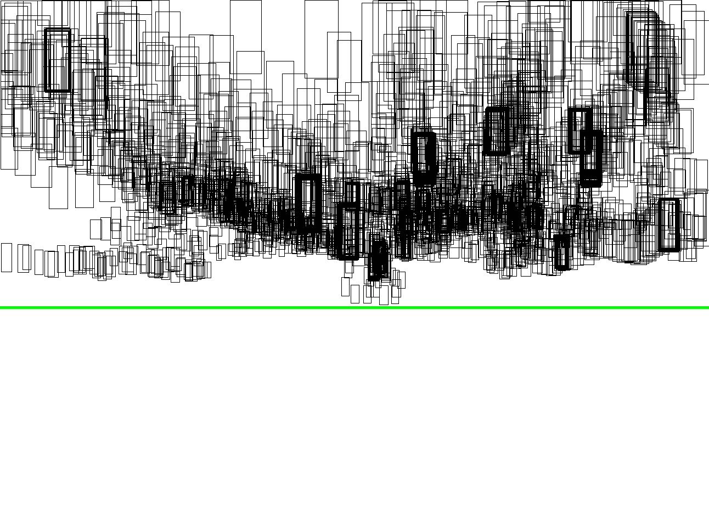

# traffic-light-tracking

Distribution of the bounding boxes. The green line (threshold).

Part of the labeled dataset is published at Baidu Yun as follows:
链接：https://pan.baidu.com/s/1mUNtCxg68TAM67xFMAKV8w 
提取码：m0a4 

test video1: 
链接：https://pan.baidu.com/s/1GRxAA0gpZ_QEBHYBP3yv6A 
提取码：d7yq

test video2:
链接：https://pan.baidu.com/s/1ac_IbaWPNn1loK5ySa86sA 
提取码：epdy

test video3:
链接：https://pan.baidu.com/s/1WX9oOpFTEMgmzQVRkTY7VQ 
提取码：v6gq 

test video4:
链接：https://pan.baidu.com/s/1Q_h6K4ekfP4tNsNjwv3qLg 
提取码：lakr 

test video5:
链接：https://pan.baidu.com/s/10lHbzoQgDra82vQW72krEg 
提取码：lhad

test video6:
链接：https://pan.baidu.com/s/1hjRVh5WFZ9GHM054XI8JWw 
提取码：kdjd
